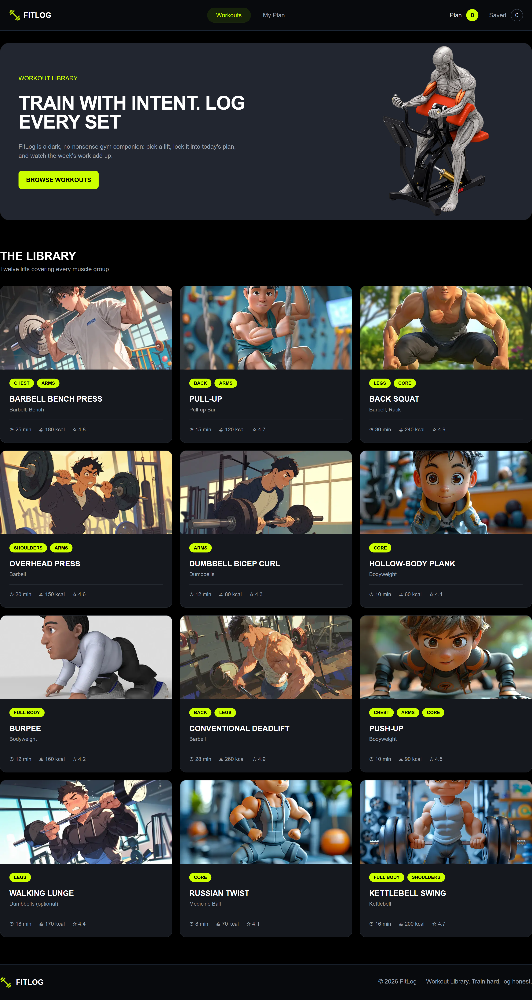
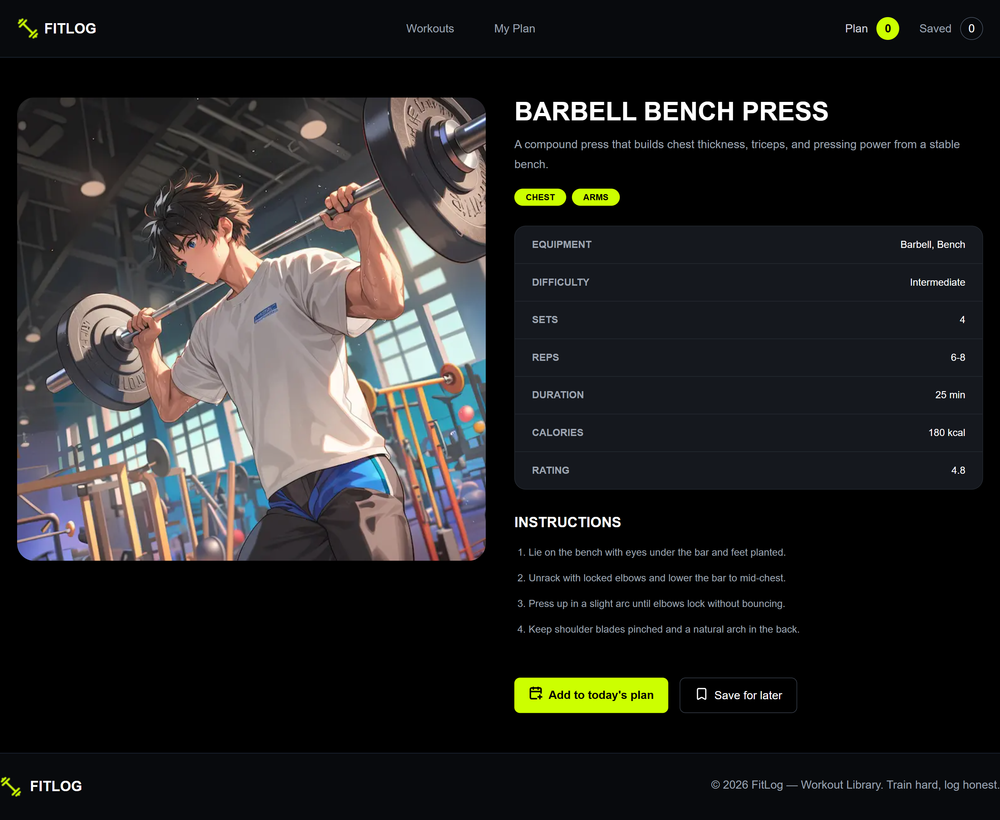

# 🏋️ FitLog — Workout Library & Plan Manager

**FitLog** is a modern workout library and personal workout planner built with **Next.js, React, Tailwind CSS, and Context API**.

The application allows users to explore a collection of exercises, open detailed workout information, build a daily workout plan, save exercises for later, mark workouts as completed, sort their selected exercises, and track total workout time and calories.

The project was developed as part of my web development course to practice **Next.js App Router, dynamic routing, Server and Client Components, React Context API, state management, data fetching, Suspense, localStorage, conditional rendering, responsive design, and third-party NPM packages**.

---

## 🌐 Live Demo

🔗 **[View Live Website](https://my-fit-log-app-delta.vercel.app/)**

---

## 💻 GitHub Repository

🔗 **[View Source Code](https://github.com/imamrakib354/My-FitLog-App)**

---

## 📸 Project Preview

### 🏠 Workout Library

<p align="center">
  
</p>

### 📋 My Plan Page

<p align="center">
  
</p>

### 🏋️ Workout Details

<p align="center">
  
</p>

---

## 🛠️ Technologies Used

- **Next.js** — Application framework, App Router, routing, layouts, Server Components, and data fetching
- **React.js** — Reusable components, state management, hooks, and Context API
- **JavaScript (ES6+)** — Application logic and data manipulation
- **Tailwind CSS** — Utility-first styling and responsive layouts
- **DaisyUI** — UI utilities and loading components
- **React Context API** — Shared workout plan and saved workout state
- **React Toastify** — Toast notifications for workout actions
- **Lucide React** — Icons used throughout the interface
- **Next/Image** — Optimized local and remote exercise images
- **Next/Font** — Optimized Google Fonts integration
- **localStorage** — Persistent workout plan and saved data
- **Vercel** — Application deployment and hosting

---

## ✨ 5 Key Features

- 🏋️ **Workout Library** — Browse a collection of exercises with muscle groups, equipment, duration, calories, and ratings.
- 📄 **Dynamic Workout Details** — Open individual exercise pages using Next.js dynamic routing to view descriptions, instructions, sets, reps, difficulty, and other workout information.
- 📋 **Today's Workout Plan** — Add exercises to a daily plan with a maximum limit of five workouts.
- 🔖 **Saved Workouts** — Save exercises for later and manage them separately from today's plan.
- 💾 **Persistent Data** — Today's plan, saved workouts, and completed workout status are stored in `localStorage`, allowing them to survive page reloads.

---

## 🚀 Additional Features

- ✅ Mark workouts in Today's Plan as completed
- ❌ Remove workouts from Today's Plan or Saved Workouts
- 🔢 Automatically update total exercises, workout duration, and calories
- ↕️ Sort workouts by **Duration, Calories, or Rating**
- 🚫 Prevent duplicate exercises from being added
- 🛑 Prevent users from adding more than five exercises to a plan
- 🔔 Toast notifications for add, save, remove, duplicate, full-plan, and completion actions
- 📊 Dynamic Plan and Saved counters in the navigation bar
- ⏳ Loading animation using React `Suspense`
- 🧩 Conditional rendering for empty plans and unavailable API data
- 🚨 Custom `404` page for unknown routes
- 📱 Responsive navigation, workout cards, plan interface, and layouts
- 🌙 Dark gym-inspired interface with neon green accent colors
- ⚡ Cached workout API requests using Next.js revalidation
- 🖼️ Optimized exercise images using `next/image`

---

## 🧠 How the Application Works

FitLog uses a combination of **Next.js Server Components and React Client Components**.

The Home page loads workout information from an external API using an asynchronous Server Component.

```js
const res = await fetch(
    "https://api.api-store.workers.dev/api/fitlog",
    {
        next: {
            revalidate: 3600
        }
    }
);
```

The workout data is then rendered as reusable `ExerciseCard` components.

Each card links to a dynamic exercise route:

```text
/Exercise/[exerciseId]
```

For example:

```text
/Exercise/3
```

Next.js reads `3` as the dynamic `exerciseId` parameter and loads the corresponding workout data.

---

## 🧩 Context API & Shared State

The application uses a global `WorkoutContext` to manage shared workout data.

The Context stores:

```text
todayPlan
savedWorkouts
doneExercises
```

It also provides functions such as:

```text
addToPlan()
addToSaved()
markAsDone()
removeFromPlan()
removeFromSaved()
```

The `WorkoutProvider` is placed in the root layout, which allows components such as:

```text
Navbar
Exercise Details
My Plan
Exercise Actions
```

to access the same shared workout state without passing props through multiple components.

---

## 💾 localStorage Persistence

FitLog stores workout plan data in the browser using `localStorage`.

The following information is persisted:

```text
todayPlan
savedWorkouts
doneExercises
```

When the application loads, a `useEffect()` retrieves previously stored data:

```js
const storedPlan = localStorage.getItem("todayPlan");

if (storedPlan) {
    setTodayPlan(JSON.parse(storedPlan));
}
```

When workout state changes, another `useEffect()` saves the latest state:

```js
localStorage.setItem(
    "todayPlan",
    JSON.stringify(todayPlan)
);
```

This allows the workout plan and saved workouts to remain available even after refreshing the browser.

---

## 📊 My Plan Dashboard

The **My Plan** page contains two tabs:

```text
Today's Plan
Saved
```

The page automatically calculates:

- Total number of exercises
- Total workout duration
- Total calories burned

For example:

```js
const totalExercises = currentWorkouts.length;

const totalMinutes = currentWorkouts.reduce(
    (total, exercise) => total + exercise.duration,
    0
);

const totalCalories = currentWorkouts.reduce(
    (total, exercise) => total + exercise.caloriesBurned,
    0
);
```

These values automatically update whenever exercises are added or removed.

---

## ↕️ Workout Sorting

Users can sort their plan by:

- Duration
- Calories
- Rating

Example:

```js
const sortedWorkouts = [...currentWorkouts].sort((a, b) => {

    if (sortBy === "duration") {
        return a.duration - b.duration;
    }

    if (sortBy === "calories") {
        return a.caloriesBurned - b.caloriesBurned;
    }

    if (sortBy === "rating") {
        return b.rating - a.rating;
    }

    return 0;
});
```

A copied array is sorted so the original Context state is not directly mutated.

---

## ✅ Mark Workout as Done

Workouts inside Today's Plan can be marked as completed.

Completed workout IDs are stored inside:

```js
doneExercises
```

The application checks whether an exercise has already been completed:

```js
const isDone = doneExercises.includes(exercise.id);
```

The button dynamically changes between:

```text
Mark as Done
Marked as Done
```

---

## 🚫 Five Workout Limit

Today's workout plan has a maximum limit of **five exercises**.

Before adding another workout, the Context checks:

```js
if (todayPlan.length >= 5) {
    toast.info("Today's plan is full");
    return;
}
```

This prevents users from exceeding the workout plan limit.

Duplicate exercises are also prevented.

---

## 🔔 Toast Notifications

The project uses **React Toastify** to provide feedback for user actions.

Toast messages are displayed when:

- A workout is added to Today's Plan
- A workout is saved
- A workout is removed
- A workout is marked as completed
- A duplicate workout is selected
- The workout plan has reached its maximum limit

Example:

```js
toast.success("Workout added to today's plan");
```

---

## ⏳ Loading & Suspense

The Home page uses React `Suspense` while workout information is loading.

```jsx
<Suspense fallback={<WorkoutLoading />}>
    <WorkoutList />
</Suspense>
```

The loading fallback displays a spinner until the workout component is ready.

This allows other parts of the page, such as the banner, to render while workout data is being prepared.

---

## 🌐 API & Data Fetching

Workout information is loaded from:

```text
https://api.api-store.workers.dev/api/fitlog
```

Single exercise information is loaded using:

```text
https://api.api-store.workers.dev/api/fitlog/:id
```

Example:

```text
https://api.api-store.workers.dev/api/fitlog/3
```

Next.js fetch revalidation is used:

```js
next: {
    revalidate: 3600
}
```

This allows workout data to be reused and refreshed periodically instead of requesting the API unnecessarily on every request.

If the workout API is temporarily unavailable, the application displays a user-friendly fallback instead of crashing.

---

## 🛣️ Application Routes

| Route | Description |
|------|-------------|
| `/` | Workout library and home page |
| `/Exercise/[exerciseId]` | Dynamic workout details page |
| `/my-plan` | Today's workout plan and saved workouts |
| Unknown Route | Custom 404 page |

---

## 📂 Project Structure

```text
my-fitlog-app/
│
├── public/
│   ├── banner.png
│   └── logo.png
│
├── src/
│   └── app/
│       │
│       ├── components/
│       │   ├── Banner.jsx
│       │   ├── EmptyPlan.jsx
│       │   ├── ExerciseActions.jsx
│       │   ├── ExerciseCard.jsx
│       │   ├── Footer.jsx
│       │   ├── NavBar.jsx
│       │   └── WorkoutList.jsx
│       │
│       ├── Exercise/
│       │   └── [exerciseId]/
│       │       └── page.jsx
│       │
│       ├── hooks/
│       │   └── useWorkout.jsx
│       │
│       ├── my-plan/
│       │   └── page.jsx
│       │
│       ├── WorkoutContext/
│       │   └── WorkoutContext.jsx
│       │
│       ├── globals.css
│       ├── layout.js
│       ├── not-found.js
│       └── page.js
│
├── next.config.mjs
├── package.json
└── README.md
```

---

## 🧱 Main Components

### `NavBar.jsx`

Handles:

- Responsive navigation
- Active route highlighting
- Today's Plan count
- Saved workout count
- Mobile dropdown navigation

### `Banner.jsx`

Displays the main FitLog hero section with:

- Workout message
- CTA button
- Workout illustration

### `WorkoutList.jsx`

Handles:

- Workout API fetching
- API error fallback
- Workout card rendering
- Next.js fetch revalidation

### `ExerciseCard.jsx`

Displays workout information including:

- Exercise image
- Muscle groups
- Exercise name
- Equipment
- Duration
- Calories
- Rating

### `ExerciseActions.jsx`

Provides:

- Add to Today's Plan
- Save for Later

### `WorkoutContext.jsx`

Manages global application state including:

- Today's Plan
- Saved Workouts
- Completed Workouts
- Add functions
- Remove functions
- Completion status
- Toast notifications
- localStorage persistence

### `My Plan`

Provides:

- Today's Plan tab
- Saved tab
- Workout statistics
- Workout sorting
- Mark as Done
- Remove workout
- View workout details

---

## 🎨 Design & Styling

FitLog uses a dark gym-inspired visual style.

Main colors include:

```text
Background: #080a0d
Card Background: #15181e
Secondary Background: #222630
Primary Accent: #ccff00
Secondary Text: #9CA3AF
Borders: #252a31
```

The project uses:

- **Oswald** for bold workout headings
- **Inter** for body text and general interface typography

The fonts are optimized using:

```js
next/font/google
```

---

## 📦 Major Dependencies

### Next.js

Used for:

- App Router
- Server Components
- Client Components
- Dynamic routing
- Layouts
- Data fetching
- Image optimization
- Font optimization

### React

Used for:

- Functional components
- `useState`
- `useEffect`
- Context API
- Conditional rendering
- Shared state management

### Tailwind CSS

Used for:

- Layout
- Flexbox
- Grid
- Responsive breakpoints
- Typography
- Colors
- Spacing
- Hover effects
- Borders and cards

### DaisyUI

Used for additional Tailwind-based UI utilities such as loading components and menu styles.

### React Toastify

Used for application notifications.

### Lucide React

Used for icons such as:

- Bookmark
- Calendar
- Check
- Clock
- Flame
- Star
- Remove icon

---

## 🚀 How to Run Locally

### 1. Clone the repository

```bash
git clone https://github.com/imamrakib354/My-FitLog-App.git
```

### 2. Enter the project directory

```bash
cd My-FitLog-App
```

### 3. Install dependencies

```bash
npm install
```

### 4. Start the development server

```bash
npm run dev
```

Open the local URL displayed in the terminal, usually:

```text
http://localhost:3000
```

---

## 📜 Available Scripts

### Development

```bash
npm run dev
```

Starts the Next.js development server.

### Production Build

```bash
npm run build
```

Creates an optimized production build.

### Start Production Build

```bash
npm start
```

Runs the production build locally.

### Lint

```bash
npm run lint
```

Checks the project for ESLint issues.

---

## 🔄 Application Data Flow

A simplified overview of the main workout flow:

```text
Workout API
     ↓
WorkoutList
     ↓
ExerciseCard
     ↓
Dynamic Exercise Details
     ↓
ExerciseActions
     ↓
Workout Context
     ↓
Today's Plan / Saved
     ↓
My Plan
     ↓
localStorage
```

Example when adding a workout:

```text
User clicks "Add to today's plan"
        ↓
addToPlan(exercise)
        ↓
Workout Context updates todayPlan
        ↓
Navbar count updates
        ↓
My Plan updates
        ↓
Metrics recalculate
        ↓
localStorage saves the updated plan
```

---

## 📱 Responsive Design

The application is designed to work across:

- 📱 Mobile devices
- 📱 Tablets
- 💻 Desktop screens

Responsive features include:

- Mobile navigation dropdown
- Responsive workout grid
- Responsive workout cards
- Flexible plan action buttons
- Responsive hero section
- Adaptive spacing and typography

---

## 🚨 Error Handling

The application includes several error-handling strategies.

### API Failure

If the workout API fails, the app displays:

```text
WORKOUTS TEMPORARILY UNAVAILABLE
Please try again shortly.
```

instead of crashing the entire interface.

### Invalid Route

Unknown URLs are handled using:

```text
not-found.js
```

which displays a custom `404` interface.

---

## 🔮 Future Improvements

Possible future improvements include:

- 🔎 Search workouts by exercise name
- 🏷️ Filter workouts by muscle group or workout tag
- 🎯 Advanced workout filters
- 📈 Weekly workout statistics
- 🔐 User authentication
- ☁️ Database-based workout storage
- 📆 Workout history
- 🏆 Workout progress tracking

---

## 🔗 Relevant Links

- 🌐 **Live Website:** [FitLog](https://my-fit-log-app-delta.vercel.app/)
- 💻 **GitHub Repository:** [My FitLog App](https://github.com/imamrakib354/My-FitLog-App)
- 🏋️ **Workout API:** https://api.api-store.workers.dev/api/fitlog

---

## 📚 Course Project

This project was developed as part of my web development course to practice building a complete application using **React and Next.js**.

The project helped me practice:

- Next.js App Router
- Static and dynamic routing
- Dynamic route parameters
- Root layouts
- Server and Client Components
- React Context API
- Custom hooks
- State management
- `useState`
- `useEffect`
- React Suspense
- API data fetching
- Conditional rendering
- Array methods such as `map()`, `some()`, `filter()`, `reduce()`, and `sort()`
- localStorage
- Responsive design
- Next.js Image optimization
- Next.js Font optimization
- Toast notifications
- Deployment with Vercel

---

## 👨‍💻 Author

**Imam Hossain Rakib**

- GitHub: [@imamrakib354](https://github.com/imamrakib354)
- LinkedIn: [Imam Hossain Rakib](https://www.linkedin.com/in/Imam-hossain-b22015381/)
- Email: rakibimam50@gmail.com

---

## ⭐ Support

If you find this project useful or interesting, consider giving the repository a ⭐ on GitHub.

**Train with intent. Log every set. 🏋️**
